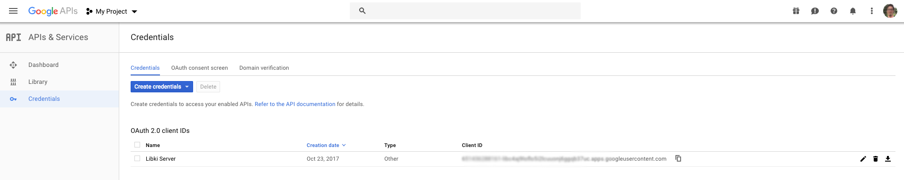

== Configuration

=== Settings

==== Basic settings

===== Default time allowance per day

This setting determines the total number of minutes a user will have for the day by default.

TIP: The value of *Default time allowance per day* should be a whole number.

===== Default time allowance per session

This setting determines the total number of minutes a user will have for each _session_ per day. So, if a system is configured with 120 minutes time allowance per day, and 30 minutes time allowance per sessions, a user will be able to log in 4 times per day for 30 minutes at a time.

TIP: The value of *Default time allowance per session* should be a whole number.

===== Default guest time allowance per day

This is the same as *Default time allowance per day*, except for guest accounts instead of regular users.

TIP: The value of *Default time allowance per day* should be a whole number.

===== Default guest time allowance per session

This is the same as *Default time allowance per session*, except for guest accounts instead of regular users.

TIP: The value of *Default guest time allowance per day* should be a whole number.

===== Client registration update delay limit

When a Libki client launches, it periodically connects to the Libki server to register itself. If a client does not re-register itself within this number of minutes, the Libki server will remove it from the list of active clients.

TIP: The value of *Client registration update delay limit* should be a whole number.

==== Data retention

===== History anonymization

This setting controls how long user and client data is retained in an un-anonymized format. If this setting is left empty, the data will be kept indefinitely.

When anonymized, a particular user will be given a new random id on a per-day basis. In this way, statistics will still be able to track usage on a per-user basis per day, but will be unable to track per-user usage over any longer time period.

TIP: The value of *History anonymization* should a whole number.

===== History retention

This setting controls how long user and client data is retained for the purpose of generating statistics and checking usage history, in days. If this setting is left empty, the data will be kept indefinitely.

TIP: The value of *History retention* should a whole number.

===== Inactive user retention

This setting controls how long a user can be inactive before being automatically deleted, in days. If this setting is left empty, all users will be kept indefinitely.

TIP: The value of *Inactive user retention* should be a whole number.

This setting should be used to conform to https://www.eugdpr.org/[GDPR] if necessary.

==== Client behavior

This setting controls how clients may be used by users. There are three possibilities.

* First come, first served.
** Allows a patron to log in to any client not currently being used.
* Reservation only.
** Requires a patron to place a reservation for a client before logging in to it.
* First come first served, with option to place reservation.
** A hybrid approach that allows patrons to log in to any client that is not currently in use or reserved.

TIP: The setting Display usernames controls if the user's username is displayed on the reserved client computer.

==== Reservations

===== Reservation timeout

The amount of time \( in minutes \) that a user has to log into his or her reserved computer. If the user does not log in within the specified time limit, the reserved client will become available again.

TIP: The value of *Reservation timeout* should be a whole number.

===== Display usernames

This setting determines if a Libki client that is reserved and waiting will display the username of the person it is waiting for.

==== Automatic time extension

Libki has an automatic time extension system that allows users to remain logged into a client computer beyond the pre-determined number of minutes per session a user is allotted.

===== Extension length

The amount of time to automatically increase a user's session time by \( in minutes \).

TIP: The value of *Extension length* should be a whole number.

===== Extend time at

This setting controls at what point in time an extension length is triggered. A session will be extended when the user's session time drops below this number, in minutes.

TIP: The value of *Extend time at* should be a whole number.

===== Extend time unless

This setting determines if a user is eligible for an automatic time extension. It has two options:

* User's client is reserved
** This choice prevents a time extension in the case that the user's client is reserved. Reservations for other client's are not taken into account.
* Any client is reserved
** This choice prevents a time extension in the case that *any* client is currently reserved. If any client is reserved a time extension will not take place, even if the users's client is not currently reserved,

===== When extending time

This setting determines how minutes are added to a patron's account when an automatic time extension occurs. It has two options:

* Take minutes from daily allotment
** This options moves minutes from the user's daily allotment of minutes to the user's session minutes. That means the user can continue using the client computer, but only up to his or her daily allotment of time.
* Don't take minutes from daily allotment
** This option adds minutes to a users session "out of thin air". As such, it does not effect how many sessions a user will have per day.

===== Terms of service

This setting allows a library to add _terms of service_ for use of computers running the Libki client. Simply adding text of your terms of service in the textbox will cause the terms to be displayed to any person logging into a Libki client. If the person chooses _yes_ the login will proceed as usual. If the person chooses _no_ the login screen will be reset.

===== Client login banners

The client banners are optional areas on the top and bottom of the Libki client login screen. They are functionally like to web browsers. As such, anything that is viewable in a web browser is viewable in the banner areas \( size permitting \).

===== Source URL

The URL for the image or html that you wish to display in the banner section.

===== Width

If the *Source URL* is an image, it can be forced to a specific width instead of using the image's actual width. Leave empty to use the image's actual width.

===== Height

This is the same as *Width* for the *Source URL* but for height.

==== Guest passes

===== Prefix for guest passes

The phrase that each guest pass username should start with. If left empty, the phrase "guest" will be used (  e.g. guest1, guest2, guest3, etc ).

TIP: This setting can be a word or short phrase, but should contain only letters and numbers. Avoid using spaces or special characters.

===== Passes to create per batch

If the _Multiple guests_ button is used, this setting will control how many guest accounts are generated with each clock.

TIP: The value of *Passes to create per batch* should be a whole number.

===== Username label

The text in this field will be prepended to the guest username, ( e.g. _"Username:"_ ).

===== Password label

This setting works the same as *Username label* but for the generated password instead of the username.

==== ILS integration

===== Patron hyperlinks

Entering a url here will cause the username in the user's table of the web administration to become a hyperlink with the user's username at the end. For example, _http://catalog.koha.library/cgi-bin/koha/members/member.pl?quicksearch=1&searchmember=_ will link to the Koha ILS's search function for the given username.

==== SIP Configuration

Single Sign-on can with an ILS can be achieved via SIP2. Settings for the ILS SIP2 server can be stored in the _libki\_local.conf_ file or the *SIP configuration* setting.

To enable SIP authentication, you will need to edit your libki_local.conf and add a section like this:
----
<SIP>
    enable 1
    host ils.mylibrary.org
    port 6001
    location LIB
    username libki_sipuser
    password PassW0rd
    terminator CR
    require_sip_auth 0
    enable_split_messages 0
    no_password_check 0 # <1>
    fee_limit 5.00 # <2>
    deny_on charge_privileges_denied # <3>
    deny_on recall_privileges_denied # <4>
    deny_on excessive_outstanding_fines # <5>
    deny_on_field AB:This is the reason we are denying you # <6>
</SIP>
----
<1> If enabled, Libki won't validate the password given against the SIP server, any password will work
<2> Can be either a fee amount, or a SIP2 field that defines the fee limit ( e.g. CC ), delete for no fee limit
<3> You can set SIP2 patron status flags which will deny patrons the ability to log in
<4> You can set as many or as few as you want. Delete these if you don't want to deny patrons.
<5> The full listing is defined in the SIP2 protocol specification
<6> You can require arbitrary SIP fields to have a value of Y for patrons to be allowed to log in. The format of the setting is _<Field>:<Message>_.

An equivilent configuration set via YAML in the system settings would look like this:
[source,yaml]
----
enable: 1
host: ils.mylibrary.org
port: 6001
location: LIB
username: libki_sipuser
password: PassW0rd
terminator: CR
require_sip_auth: 0
enable_split_messages: 0
fee_limit: 5.00
deny_on:
  - charge_privileges_denied
  - recall_privileges_denied
  - excessive_outstanding_fines
deny_on_field: "AB:This is the reason we are denying you"
----

The SIP section requires the following parameters:

* enable: Set to 1 to enable SIP auth, 0 to disable it.
* host: The SIP server's IP or FQDN.
* port: The port that SIP server listens on.
* location: The SIP location code that matches the sip login.
* username: The username for the SIP account to use for transactions.
* password: The password for the SIP accouant to use for transactions.
* terminator: This is either CR or CRLF depending on the SIP server. Default is CR
* require_sip_auth: Does this SIP server require a message 93 login before it can be used? If so this should be set to 1 and the username/password fields should be populated. This should be set to 1 for Koha.
* enable_split_message: IF thie server supports split messages you can enable this. This should be set to 0 for Koha.
* fee_limit: As notated, this can be a set number or a SIP field to check. If the fee limit is exceeded, the user login will be denied.
* deny_on: This can be repeated to deny logins based on the patron information flags detailed in the SIP2 protocol specification.
* deny_on_field: This can be repeated to deny logins if the Specified field does not have a value of "Y".
==== LDAP

Single Sign-on with other systems can be achieved via LDAP. Settings for LDAP server are currently stored in the _libki\_local.conf_ only, though setting support is expected soon.

TIP: Make sure the URL beings with http:// or https:// as necessary.

=== Closing hours

Closing hours are a way to prevent users from starting a session that will be cut short by the closing of the location he or she is at. Closing hours can be set on a site-wide basis, or on a per-location basis. If a given location has no closing hours set, that location will use the _All locations_ closing hours.

=== Print management

Print management in Libki is powered by Google Cloud Print. To set up print management, first set up your printers in Google Cloud Print. Next, generate a client id and secret. Finally, enter your configuration in the *Printer configuration* setting as YAML. The code block below is an example configuration with two printer profiles for a single printer ( one color, one monochrome ).

==== Finding your cloud printer id:
. Set up the printer for Google Cloud Print
. Browse to https://www.google.com/cloudprint/simulate.html
. Use the Printer Search API to search for you printers, or browse to https://www.google.com/cloudprint/search directly
. Locate your printer in the results, find the "id" field, it should look something like `id: "ed4ddb78-dc03-8574-8687-be3995df8cd4"`

==== Getting your client id and client secret
. Get oAuth2 Credentials
. Browse to https://console.developers.google.com/
. Enable Cloud API
. Create credentials for OAuth 2 type=“Other”
. Save the ID and secret for use in the Libki print configuration

.Google Developer Console
[#img-google-developer-console]


==== Setting up your print management configuration

You can use the configuration below as a template, simply replace the `client_id`, `client_secret`, and `google_cloud_id` field values with your own.

Note the example has two instances of the same printer installed, one for printing in color, and one for monochrome.

[source,json]
----
google_cloud_print:
  client_id: 893746288161-libc4aj9loitf5i2lcuuonj6ggqb37uc.apps.googleusercontent.com
  client_secret: dEjNmggj-PS9_LnvP92jIYu3

printers:
  color:
    type: google_cloud_print
    google_cloud_id: d4355eb9-5b5b-3982-1492-9a1245298409
    name: color
    ticket:
      color:
        type: STANDARD_COLOR

  monochrome:
    type: google_cloud_print
    google_cloud_id: d4355eb9-5b5b-3982-1492-9a1245298409
    name: monochrome
    ticket:
      color:
        type: STANDARD_MONOCHROME
----

==== Authorizing your server to use the Cloud Print API
. Run `script/administration/enable_google_cloud_print.pl`
. Open the URL given in a web browser
. Authorize your account
. Copy and paste the code you are given back into the script
. Hit enter
. You should recieve the message `Session stored.` if everything was successful.

==== Configuring your clients

After you've set up your server for print management, you will then need to configure your clients as well.
To accomplish this, you must edit the `Libki Kiosk Management System.ini` file.
On Windows operating systems, this file is most often located in `C:\ProgramData\Libki` but may be located elsewhere depending on your specific OS configuration.
You will most likely need to edit this file as an Administrator.

Once you have located the file, you will need to add a new configuration block to the bottom.
```
[printers]
color="C:\\printers\\color"
monochrome="C:\\printers\\monochrome"
```

As you can see, the printers match the `name:` fields defined print management configuration for the server.
You will also need to ensure those directories exist on the client computer.
Once the Libki client has been started, it will watch those directories for PDF files.
When the client sees a file, it will uploaded it to the server with the matching printer name.

You can use any PDF print driver to print PDF file to these directories.
A custom PDF print driver for Libki is in development, but not yet available.
